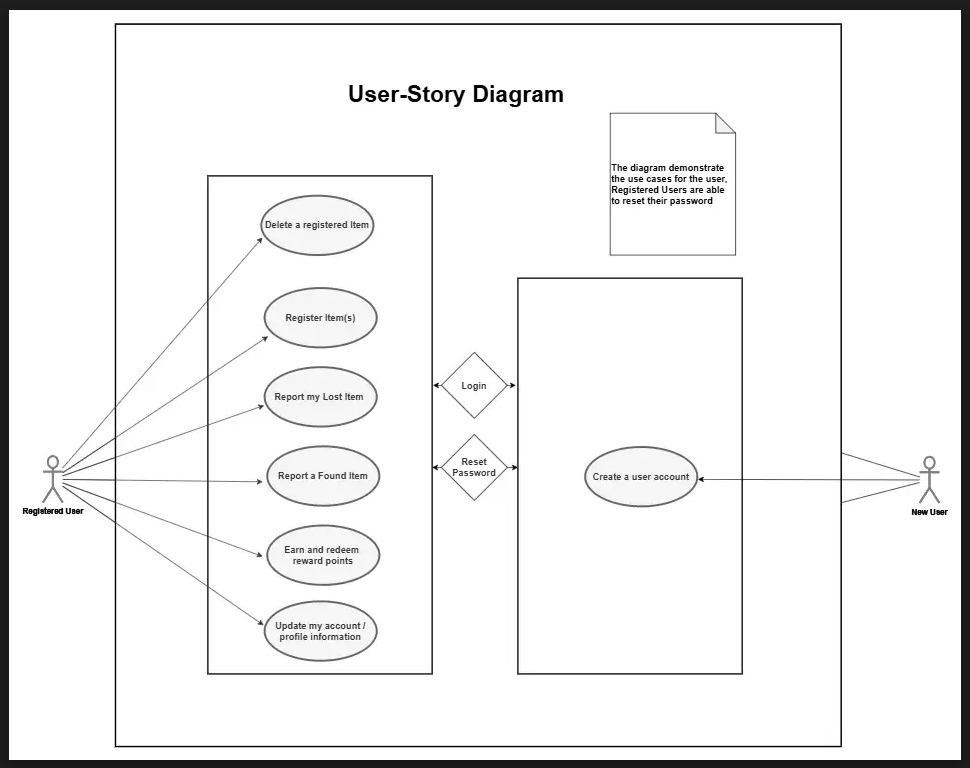

# Lost Item Reporting App (LIRA)
> Thesis Documentation |
[**Download My CV**](https://collinsawsbucketlist.s3.us-east-1.amazonaws.com/AWS_S3/CV+-+Collins+Amalimeh.pdf)

## Abstract
The application aims to connect finders of lost items with their rightful owners in a seamless, efficient manner, leveraging item descriptions and unique barcode identifiers for quick and accurate matching. Owners of personal belongings are encouraged to attach unique printable barcodes to their items upon registration, simplifying identification and tracking if the items are reported lost. Once an item is found and reported by an app user, the owner is notified instantly, provided they are registered in the system. As a way to motivate participation, finders of lost items are rewarded with points that can later be redeemed as coupons in partnered stores.

## Libraries and Frameworks
This project was built with `React`, `React-Native`, and `Expo` libraries to create a functional, responsive and user-friendly interface, ensuring consistency and usability. Backend functionality is managed through Node.js and Express, while Expo is used to streamline the development and deployment process in mobile environment. The system architecture  involves a central database that securely stores user and item information, ensuring data privacy and reliability.

## Database Server
The database used for this project is MongoDB. MongoDB is a document-oriented database that stores data in key-value pairs, using a format similar to JSON. Internally, it uses a binary representation called BSON (Binary JSON), which allows for efficient storage and retrieval of data. [Skip to this chapter]()

## Authentication Methology Used
#### Bycrypt
Bcrypt is a password hashing library designed to be computationally intensive to resist brute-force attacks. It is widely used for securely storing passwords in varioius applicaitons. [See the code snippet and documentation]()
#### JSON Web Token (JWT)
This app uses `JSON Web Tokens (JWT)` to securely `authenticate` users and `authorize` their transactions and activities. A JWT is a compact, URL-safe token used for transmitting information between parties as a JSON object. It is commonly used for authentication and data exchange. A typical JWT consists of three parts: the header, payload, and signature, each separated by dots (.). [See implementation]()

## References
w3schools.com
[see](http://reactnative.dev/docs/)

## Application Features

| Feacture | Description |
| ----------- | ----------- |
| **User Registration** | New users can sign up using their email and password to create an account. 
| **User Login**   | Registered users can securely log in to access the app's features.
|`Stash` Registration | Users can register their personal belongings by uploading pictures and providing details such as serial number, product number, tag number (for pets), and a description. The app generates a unique barcode for each registered item to ensure seamless identification.
| Deleting `Stash`| Allows Users to delete already registered belongings.
| Lost `Stash` Reporting | Enables users to report and submit detailed descriptions of lost items.
| Found Item Reporting | Users can report found items through the app. If the item has a registered barcode, the owner is automatically notified for retrieval. Unregistered items are retained for 30 days and deleted if unclaimed.
|  In-App Found `Stash` reporting | Lost items are displayed on the app’s newsfeed. Users who find an item can report it by entering the item's barcode and their phone number. The owner is then notified and can contact the finder directly using the provided contact details.
| Profile Update | Users can update their profile information, including username, full name, email address, password, and profile picture for a personalized experience.
|Reward System | Introduces an incentive structure where users earn points for each lost item reported, which can later be redeemed as discounts in partner stores. (In production)
| Logout | logged-in users can log out. 

## User Story

> User Story and Acceptance Criteria for both registered and new Users

| Action         | Reason                                                                                                                                   | Acceptance Criteria |
|----------------|------------------------------------------------------------------------------------------------------------------------------------------|----------------------|
| Create Account | I want to create an account using my email or phone number, so that I can access and personalize my experience within the application. |                  |
| Login to my account           | As a registered user, I want to log into my account so that I can access my dashboard and use the app's features securely.                                  | User can enter valid credentials to access their account.  Invalid credentials show an error.  Option to stay logged in. |
| Register an Item              | As a user, I want to register an item I own so that I can track or recover it if it gets lost.                                                              | User fills in item details.  Unique identifier or serial number required.  Item appears in user dashboard after save.   |
| Report my lost item           | As a user, I want to report my item as lost so that others can help me find it or return it.                                                                | User can mark a registered item as lost.  Lost item is flagged in the system.  Notification sent to nearby users.       |
| Report a found item           | As a user, I want to report an item I found so that the rightful owner can be notified.                                                                     | User fills in description and location.  System checks for potential matches.  Owner is notified if a match is found.  |
| Delete a registered item      | As a user, I want to delete an item I previously registered so that I can remove items I no longer own.                                                    | User selects an item and confirms deletion.  Deleted item no longer appears in dashboard.  Deletion confirmation shown.|
| Update my account/profile info| As a user, I want to update my profile information so that my account details remain current and accurate.                                                  | User can update name, contact, and photo.  Changes are saved and reflected immediately.  Input validation in place.     |
| Reset my password             | As a user, I want to reset my password so that I can regain access if I forget it.                                                                          | User enters email or phone.  Receives a reset link or OTP.  Password is successfully changed after confirmation.       |
| Log out                       | As a logged-in user, I want to log out of my account so that I can keep my information secure when I’m done using the app.                                  | Logout button is accessible from Dashboard screen.  User session ends and redirected to login or landing page.  Session data and token are cleared. |

 
 

